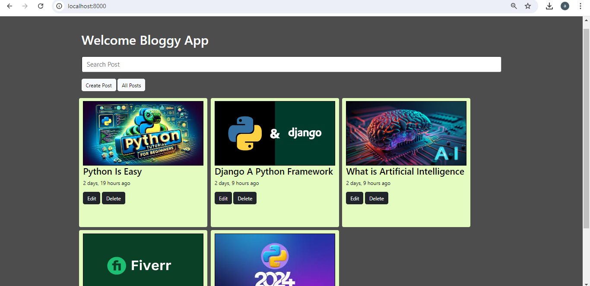

# Django Blog

This Django project, titled "Blog," is a simple yet functional blogging platform where users can create, update, and delete posts. In addition to basic CRUD operations, the project features a search functionality that allows users to easily find specific posts. This project highlights the essential aspects of content management, demonstrating how Django can be used to build straightforward and effective web applications.

## 🛠 Skills
HTML, CSS, Python, Django, Bootstrap

## Screenshots

